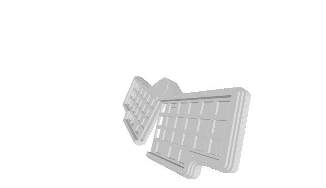

> [!CAUTION]
> This is still a work in progress and not yet fully tested! I messed up my last order from Mouser and need to get the missing components the next time I get to order.

# klappbrettle

a 40% ortho keyboard with a hinge

## design

I love using ortho keyboards but non-split ortho keyboards are getting uncomfortable for me fast so I thought about adding a hinge at the top.

It kind of resembles a starter clapper so that's where it got its name and athletics theme.

## pcb

PCBWay kindly offered to sponsor the pcb for this project that's why I got my hands on the pcbs within almost a week after ordering.  
The order process is straight forward and you also get an instant quote before ordering. After placing the order a technician checked and corrected the drill holes of the mouse bits within a few hours and the pcb was sent to manufacturing.
I'm impressed with the speed an quality of the pcb, see below:

The pcb is a two panel design where both sides are connected via a 10 pin JST connector. It's powered by a RP2040 microcontroller so there is plenty of flash storage. You can clip off the mod columns or the outer thumb key if want to. There are also extra holes where you can put grommets so the switches don't pop out of the 3mm plate.

- [x] complete the pcb design
- [ ] order missing components and solder

## case

The case is a 3mm acryl sandwich style case with a hinge to connect the halves and route the cable through. The hinge can be either 3d printed or can be 3mm acryl as well. I still need to test what works best, so far I only have a 3d printed prototype at hand.

- [x] complete the acrylic case design
- [ ] make the bottom plates look a bit nicer
- [ ] prepare dxf files and variants for laser cutting

## firmware

This will be powered by QMK but the firmware isn't ready yet.

- [ ] finish qmk firmware
- [ ] add vial support

## acknowledgements

Huge thanks to PCBWay for offering to sponsor this project, hlord2000 for their [RP2040 KiCAD template](https://github.com/hlord2000/Ohmbedded-RP2040-PCB-Template) as well as the ClackTales community for helping me with the theme.
